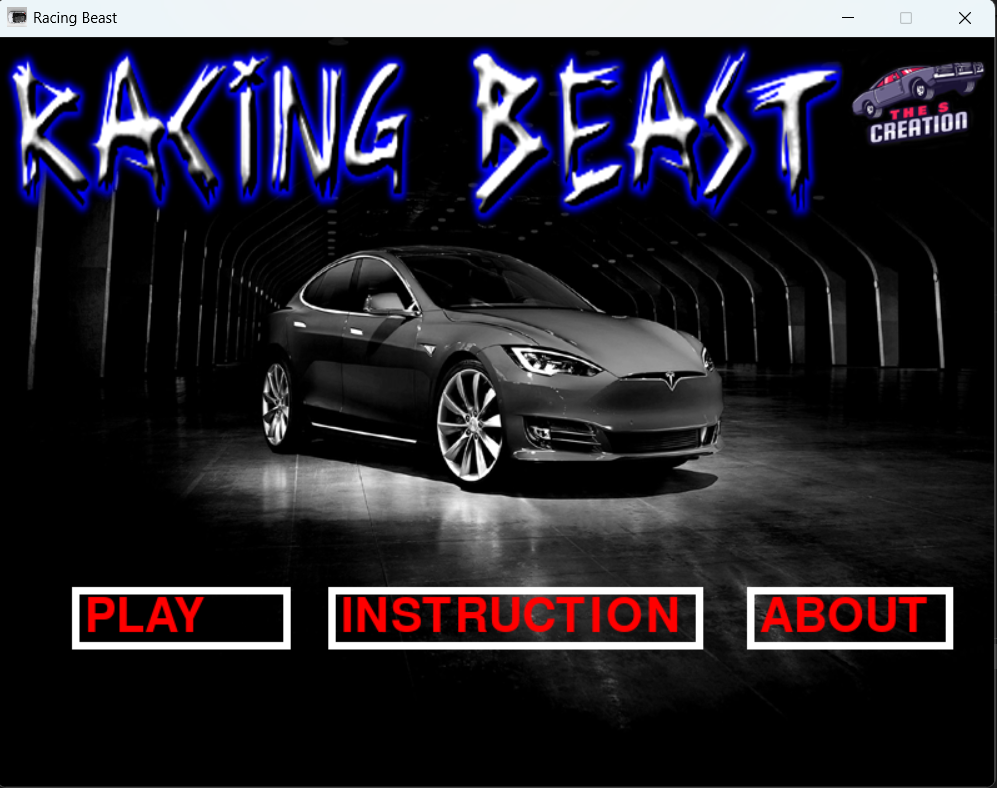
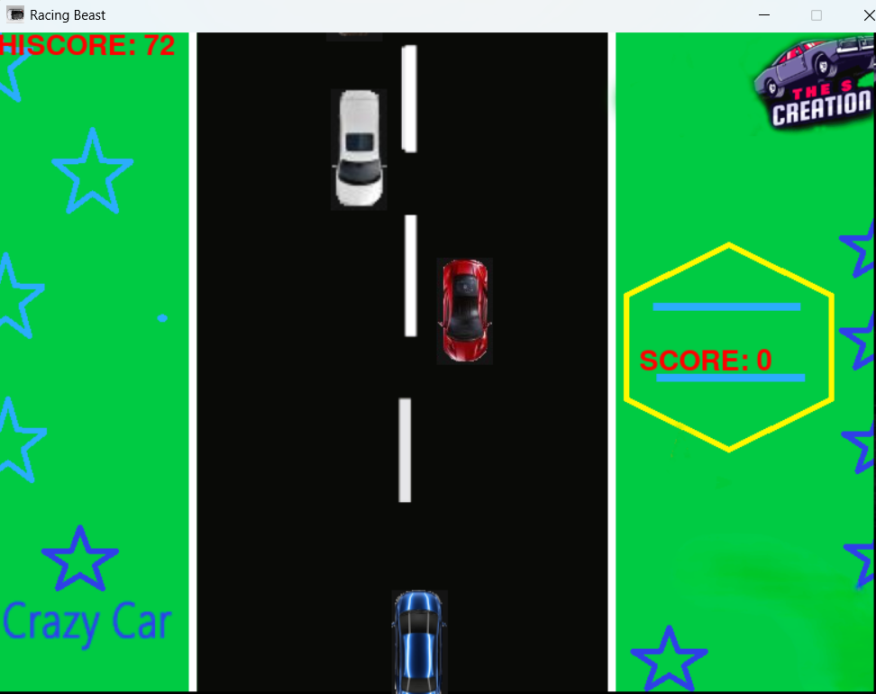
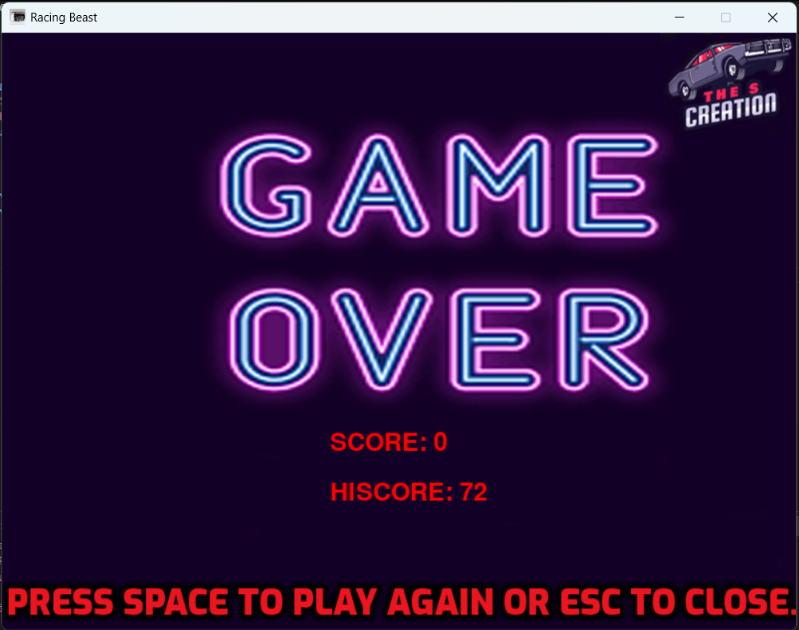

# Minor-Project-2
# Racing Beast
Racing Beast is a car racing game which is a fun and engaging genre of video game where players control a car and compete to win a race, avoid obstacles, or beat a timer.
## Table of contents

- [About](#About)
- [Technologies used](#Technologiesused)
- [Project Structure](#ProjectStructure)
- [Features](#features)
- [Getting started](#GettingStarted)
- [Setup & Installation](#Setup&Installation)
- [Notes](#Notes)
- [Example interaction](#Exampleinteraction)
- [License](#-license)
---
## About
The Car Racing Game is a 2D endless runner-style game built using Python and Pygame. In this game, the player controls a car driving on a busy road with the goal of avoiding oncoming enemy cars for as long as possible. The background road scrolls continuously to simulate motion, and the speed gradually increases to make the game more challenging over time. The game features intuitive controls, basic sound effects, and a scoring system that tracks the player's survival time. This project demonstrates core concepts of game development such as sprite handling, collision detection, user input, and modular code structure, making it a great learning experience and a fun, playable game.

## Technologies used
- python
- pygame
- Assets (Graphics & Audio)
- Editor / IDE
- VS Code (with Python extension)
- PyCharm
  
## Project Structure
```bash
car-racing-game/
│
├── assets/                   # Game assets
│   ├── car.png               # Player's car image
│   ├── enemy_car.png         # Enemy car image
│   ├── road.png              # Road background image
│   └── crash.wav             # Crash sound effect
│
├── main.py                   # Main game loop and setup
├── game.py                   # Core game logic and mechanics
├── utils.py                  # Utility/helper functions
└── README.md                 # Project documentation
```
### Key Features:
- Smooth car control using arrow keys
- Continuously scrolling road animation
- Randomly appearing enemy cars
- Collision detection with game over sound
- Score tracking for how long you survive
- Organized codebase with separate modules for game logic and utilities

## Why I consider building a weather app?
-	Creating a weather website can be a fulfilling project that serves a broad audience. With the right set of tools and a well-thought-out approach, your website can become a go-to resource for weather information.
-	High Demand and Utility which means Weather websites are visited regularly, fostering repeat traffic.
-	building a weather app project allows you to apply your web development skills to a real-world application.
-	it helps you to better understand DOM manipulation, Event handling, CSS styling, APIs, and more.
-	Weather websites can generate revenue through ads, affiliate marketing, premium subscription services (like ad-free access or advanced data), or partnerships with businesses in travel, outdoor gear, or agriculture.
-	A weather website can foster an engaged community by offering localized features. Users may share updates, storm reports, or photos, helping to build trust and expand your platform organically.

## Steps To Create Car Racing Game
### To create racing beast using pygame, follow these step-by-step instructions:

Create a folder. You can name this folder whatever you want, and inside this folder, create the mentioned files.
Create an index.html file. The file name must be index and its extension .html
Create a style.css file. The file name must be style and its extension .css
Create a script.js file. The file name must be script and its extension .js

## Setup & Installation
You can easily set up this weather app locally by following these steps:
### Prerequisites 

- Python 3.x
- Pygame library

Install Pygame with:

```bash
pip install pygame
```

## 💡Future Enhancement
- Add power-ups and boosters
- Include different car models to choose from
- Implement a main menu and pause/resume feature
- Save and display high scores
- Add levels or difficulty progression
  

### Clone the repository (Optional)

If you want to clone the repository and run it locally, follow these steps:

1. Clone the repository:

    ```bash
    git clone https://github.com/yourusername/weather-app.git
    cd weather-app
2. Open the `index.html` file in your browser.

   You don't need any server or backend for this app since it's fully frontend-based.
   
## live Demo



   

## Example interaction
User : "Delhi"
Weather app:"Delhi (2024-11-21)
Temperature: 25.06°C
Wind: 1.8 M/S
Humidity: 33%"

## 📜 License
This project is [MIT](./LICENSE) licensed. 


